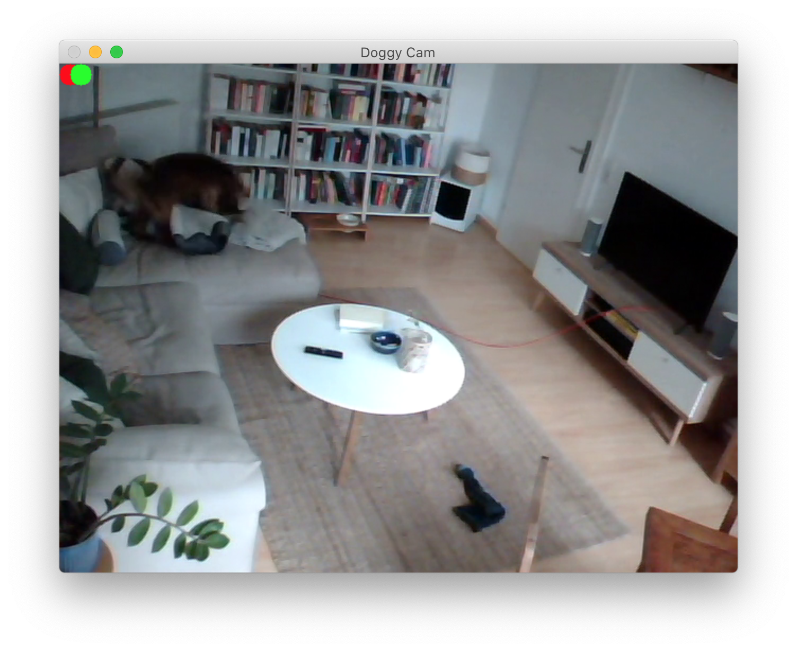

# Project: Doggy Cam
## Project structure
The project has the following folders and files (not complete):
```
.
├── README.md
├── algorithm.py            - implementation of the doggy cam algorithm
├── evaluate_algorithm.py   - script to analyse the algorithm output with the 
│                             reference
├── convert_annotation.py   - convert the video annotation .csv files for the 
│                             evaluate_algorithm script
├── requirements.txt        - specifies the needed python modules for pip
├── Makefile                - Makefile for converting annotations, running the 
│                             algorithm and evaluating the algorithm output
├── video                   - contains the video files, the annotation configuration
│   ├── John_1.json           - video annotation tool project file
│   ├── John_1.mp4            - video file
│   ├── John_2_1.mp4
│   ├── John_2_2.mp4
│   ├── John_3.mp4
│   ├── ...
│   └── Makefile            - Makefile for converting .mov files to .mp4 video
├── output        
│   └── John_1-dummy_v1.pkl - algorithm output with version string
└── reference
    ├── John_1.csv          - video annotation output for video
    └── John_1.pkl          - converted video annotation reference
```

All python modules and scripts are put in the project root folder. The input and
output files are in subfolders, as shown above.

# Workflow
For developing and improving the algorithm, the following workflow is proposed:

 1. Change algorithm in algorithm.py
 2. Run algorithm on a video or all videos with run_algorithm.py (or Makefile)
 3. Evaluate algorithm with evaluate_algorithm.py and see if result is better than before

# Running the algorithm
For running the algorithm, the module `run_algorithm.py` was created, that has a
commandline interface. Here a version of the commandline interface help is shown:

```
> python3 run_algorithm.py -h
usage: run_algorithm.py [-h] [-s] file

Run the motion detection algorithm on the given file.

	It can show the processing happening live. The current motion detection
	output is shown as a colored circle on top of the video in green (calm) or 
	red (motion detected).
	The output is saved in the folder output.
	The execution can be quit by pressing q, when focusing the output window.

positional arguments:
  file        The video file path to run the algorithm on.

optional arguments:
  -h, --help  show this help message and exit
  -s, --show  Show the algorithm output live
```

For running the algorithm on more than one video file, a Makefile can be used. 
The Makefile can detect all video files and then run the script for each 
video file in the video folder.

When running with the flag `--show`, an overlay is shown for the algorithm 
output and the reference data (if available). It looks like this:



The circle in front (green) is the output of the algorithm and the circle half 
shown (red) is the reference. Red means motion and green calm.

# Evaluating the algorithm
The evaluation script is started like this:

```
> python3 evaluate_algorithm.py dummy_v1
```
It takes a string describing the algorithm version and finds the output and 
reference data automatically. The help menu is shown here:
```
> python3 evaluate_algorithm.py -h
usage: evaluate_algorithm.py [-h] algorithm

Evaluate the output of the given algorithm against the reference data.

  Finds the algorithm output data automatically from the output folder and
  loads the corresponding reference data. It outputs the evaluation on the 
  terminal.

  TODO: save the data

positional arguments:
  algorithm   Algorithm name, for example dummy_v1

optional arguments:
  -h, --help  show this help message and exit
```

The output for the dummy_v1 algorithm (never detect motion) for the first video
with annotation:

```
> python3 evaluate_algorithm.py dummy_v1
Algorithm data files found: ['output/John_1-dummy_v1.pkl']
Reference data files found: ['reference/John_1.pkl']
File: John_1
  True positives:   0.0s of 180.0s (0.0%), 0 of 1351 frames.
  False positives:  0.0s (0 frames).
```